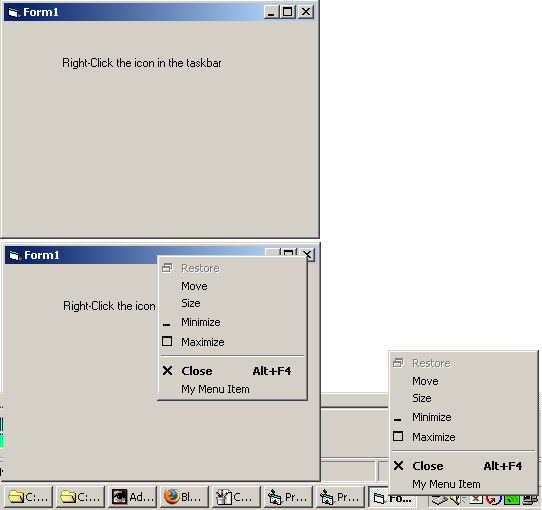



## Popup Menu in TaskBar and App's TitleBar\.

### Description

I recieved a question via email, on how to add an option to a taskbar. This application demonstrates just that. When running apps in windows, you can right-click on the taskbar and you will get a popup menu with 'Close' 'Move 'Minimize' etc. This shows how to add to that menu. Works in both, taskbar and titlebar. Hope that will answer some questions.
 
### More Info
 

             |
---                |---
**Submitted On**   |2006-09-05 00:18:10
**By**             |[Serge\_G](https://github.com/Planet-Source-Code/PSCIndex/blob/master/ByAuthor/serge-g.md)
**Level**          |Intermediate
**User Rating**    |5.0 (15 globes from 3 users)
**Compatibility**  |VB 5\.0, VB 6\.0
**Category**       |[Complete Applications](https://github.com/Planet-Source-Code/PSCIndex/blob/master/ByCategory/complete-applications__1-27.md)
**World**          |[Visual Basic](https://github.com/Planet-Source-Code/PSCIndex/blob/master/ByWorld/visual-basic.md)
**Archive File**   |[Popup\_Menu201794952006\.zip](https://github.com/Planet-Source-Code/serge-g-popup-menu-in-taskbar-and-app-s-titlebar__1-66464/archive/master.zip)

